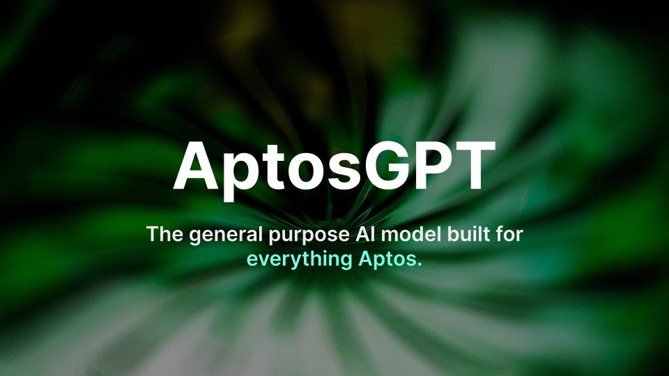

# Introducing AptosGPT 🤖

AptosGPT is the general purpose AI model built for everything Aptos.

Built from the ground up for developers, users & beginners of the Aptos blockchain, aiming to cover any use cases & knowledge gaps.

## How does it work?

Initially built during the [Hack Holland hackathon](https://aptosfoundation.org/events/hack-holland-2023), AptosGPT aims to be a powerful tool & make Aptos more accesible for all.

Using OpenAI's APIs, we train the GPT-3 model with the latest data about Aptos: documentation, Move resources, code examples, tutorials, etc.

One way to do that is fine-tuning, which turned out not to be that feasilbe. A better approach might be using vector embeddings, which we'll explore in the next days / weeks.

Once the model in trained & ready to use, anyone will be able to access it using the [Client](https://github.com/lucasmanea21/aptosgpt/tree/main/client), with a UI & UX similar to that of ChatGPT.

## Training

coming soon

## Data used

- [The Aptos Documentation](https://aptos.dev)
- [The Move Language book](https://move-book.com/)
- [Learning Move resources](https://move-book.com/)

With much more coming soon.

## Usage

Check out the [Client directory](https://github.com/lucasmanea21/aptosgpt/tree/main/client).

## Contributing

AptosGPT is going to be a fully open-source project. If you intend to contribute, feel free to [contact me](https://lucasmanea.com) or just create a pull request.

## Roadmap

In no particular order:

- [ ] Adding vector embeddings
- [x] Open-sourcing the model
- [ ] Enlarging the training pool
- [ ] Pulling questions and answers from Discord
- [ ] Switching to GPT-4 (once API is available)
- [ ] Launching the Client
